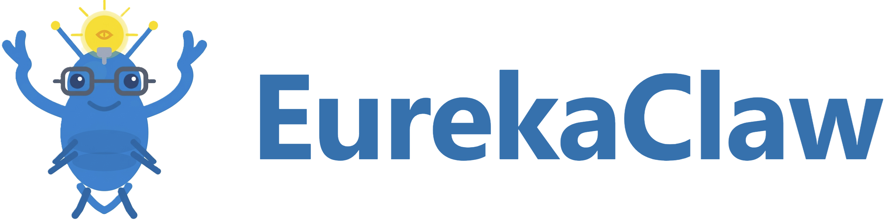

<p align="center">
  
</p>

<p align="center">
  <strong>捕捉你的尤里卡时刻的 AI。</strong><br/>
  爬取 arXiv · 生成定理 · 证明引理 · 撰写 LaTeX 论文 · 运行实验<br/>
  一切都从你的聊天或终端开始。
</p>

<p align="center">
  <a href="https://github.com/EurekaClaw/EurekaClaw/stargazers"></a>
  
  
  
</p>

<p align="center">
  <a href="https://www.eurekaclaw.ai/"></a>
  <a href="https://eurekaclaw.github.io/zh/"></a>
  <a href="https://www.xiaohongshu.com/user/profile/69bf26c7000000003402ea57"></a>
  <a href="https://discord.gg/SprC5BgmcW"></a>
</p>

<p align="center">
  <a href="README.md">English</a> | <strong>中文</strong>
</p>

```
$ eurekaclaw prove "Find recent papers on sparse attention + prove efficiency bound"

🦞 Crawling arXiv cs.LG (2024–2025)...
📄 Found 23 relevant papers. Summarizing...
💡 Hypothesis generated: O(n log n) via topological filtration
✨ Theorem 3.1 drafted. LaTeX ready. Proof complete.
🦞 Eureka! Paper draft saved to ./results/
```

---

**EurekaClaw** 是一个多智能体 AI 科研助手，能够从一个问题出发，自主完成到可发表成果的全过程。它爬取文献、生成并压力测试假设、运行实验并撰写发现报告，一切均可在终端或浏览器 UI 中完成。

> **开源 · 本地优先 · 隐私设计 · Apache 2.0 许可证**

---

## EurekaClaw 能做什么

| | 功能 | 描述 |
|---|---|---|
| 🔍 | **文献爬取器** | 从 arXiv 和 Semantic Scholar 获取、摘要并交叉引用论文 |
| 💡 | **想法生成器** | 通过综合数千篇论文的规律，产生新颖假设 |
| 🔢 | **定理证明器** | 通过 7 阶段自底向上流水线生成、验证并形式化证明 |
| 📄 | **论文撰写器** | 起草包含定理环境和引用的相机就绪 LaTeX 论文 |
| 🖥️ | **本地运行** | 兼容所有主流模型 API — 隐私设计 |
| 🧠 | **持续学习** | 每次会话后将证明策略提炼为技能，持续改进 |
| 🧪 | **实验运行器** *（开发中）* | 数值验证理论界限；标记低置信度引理 |
| 🌐 | **浏览器 UI** | React + TypeScript 界面 — 实时智能体追踪、证明草图、暂停/恢复、技能管理器 |

---

## 安装

**macOS / Linux**

```bash
curl -fsSL https://eurekaclaw.ai/install.sh | bash
```

**Windows** *（开发中 — 尚未完全支持）*

```powershell
powershell -c "irm https://eurekaclaw.ai/install_win.ps1 | iex"
```

macOS/Linux 安装程序会克隆仓库、创建虚拟环境、安装 EurekaClaw，并将 `eurekaclaw` 命令添加到 PATH。之后运行 `eurekaclaw onboard` 以配置 API 密钥和设置。

> **Windows 用户：** 原生 Windows 支持正在积极开发中。在此期间，请使用 [WSL 2](https://learn.microsoft.com/en-us/windows/wsl/install)（Ubuntu）并在 WSL 终端中按照 macOS/Linux 说明操作。

<details>
<summary>手动安装（所有平台）</summary>

**要求：** Python ≥ 3.11，Node.js ≥ 20，Git

```bash
git clone https://github.com/EurekaClaw/EurekaClaw
cd EurekaClaw
make install                  # pip install -e "." + npm install（前端）
```
</details>

---

## 快速开始

```bash
eurekaclaw onboard            # 交互式设置向导（创建 .env）
# — 或 — cp .env.example .env 并手动添加 ANTHROPIC_API_KEY

eurekaclaw install-skills     # 安装内置证明技能（执行一次）

# 浏览器 UI — 构建前端并在浏览器中打开
make open

# CLI — 证明一个猜想
eurekaclaw prove "The sample complexity of transformers is O(L·d·log(d)/ε²)" \
    --domain "ML theory" --output ./results

# CLI — 探索某个领域
eurekaclaw explore "multi-armed bandit theory"

# CLI — 从 arXiv 论文出发
eurekaclaw from-papers 1706.03762 2005.14165 --domain "attention mechanisms"
```

> 没有 API 密钥？通过 [OAuth](https://eurekaclaw.github.io/zh/getting-started/authentication.html#option-b-claude-pro-max-via-oauth) 使用 Claude Pro/Max 订阅。

---

## 流水线

<p align="center">
  
</p>

---

## 输入模式

| 命令 | 级别 | 适用场景 |
|---|---|---|
| `eurekaclaw prove "<conjecture>"` | 1 | 你有一个精确的数学命题需要证明 |
| `eurekaclaw from-papers <ids>` | 2 | 你想扩展或发现特定论文中的研究空白 |
| `eurekaclaw explore "<domain>"` | 3 | 你有一个宽泛的研究领域但尚无具体猜想 |

---

## 文档

详细文档请见 https://eurekaclaw.github.io/zh/ 。

| | |
|---|---|
| 📖 [**用户指南**](https://eurekaclaw.github.io/zh/user-guide/index.html) | 安装、演练、门控模式、调优、故障排除 |
| ⚙️ [**配置**](https://eurekaclaw.github.io/zh/reference/configuration.html) | 所有 `.env` 变量及默认值 |
| 🏗️ [**架构**](https://eurekaclaw.github.io/zh/reference/architecture.html) | 流水线阶段、数据流、组件设计 |
| 🤖 [**智能体**](https://eurekaclaw.github.io/zh/reference/agents.html) | 每个智能体的角色、输入、输出和工具使用 |
| 🔧 [**工具**](https://eurekaclaw.github.io/zh/reference/tools.html) | arXiv、Semantic Scholar、Lean4、WolframAlpha、代码执行 |
| 💻 [**CLI 参考**](https://eurekaclaw.github.io/zh/reference/cli.html) | 所有命令和选项 |
| 🐍 [**Python API**](https://eurekaclaw.github.io/zh/reference/api.html) | `EurekaSession`、`KnowledgeBus`、数据模型 |
| 🧠 [**记忆系统**](https://eurekaclaw.github.io/zh/reference/memory.html) | 情节记忆、持久记忆和知识图谱层 |
| ✨ [**技能**](https://eurekaclaw.github.io/zh/reference/skills.html) | 技能注册表、注入、提炼、编写自定义技能 |
| 🔌 [**领域插件**](https://eurekaclaw.github.io/zh/reference/domains.html) | 插件架构、MAB 领域、添加新领域 |
| 🌐 [**UI 设计**](https://eurekaclaw.github.io/zh/user-guide/browser-ui.html) | React/TS 架构、组件树、运行命令 |

---

## 配置要点

```bash
cp .env.example .env
```

| 变量 | 默认值 | 描述 |
|---|---|---|
| `ANTHROPIC_API_KEY` | — | API 密钥（或使用 OAuth，参见[用户指南](https://eurekaclaw.github.io/zh/getting-started/authentication.html)） |
| `EUREKACLAW_MODEL` | `claude-sonnet-4-6` | 主推理模型 |
| `GATE_MODE` | `auto` | `none` · `auto` · `human` |
| `THEORY_PIPELINE` | `default` | `default` 或 `memory_guided` |
| `OUTPUT_FORMAT` | `latex` | `latex` 或 `markdown` |
| `EXPERIMENT_MODE` | `auto` | `auto` · `true` · `false` |
| `THEORY_MAX_ITERATIONS` | `10` | 最大证明循环迭代次数 |

完整参考 → [configuration.md](https://eurekaclaw.github.io/zh/reference/configuration.html)

---

## 评估

EurekaClaw 包含一个 **Scientist-Bench** 评估器：

| 维度 | 权重 |
|---|---|
| 形式正确性（Lean4 / LLM 同行评审） | 0.35 |
| 新颖性（与已知结果的嵌入距离） | 0.25 |
| 实验一致性 | 0.15 |
| 证明深度（引理数量） | 0.15 |
| 引用覆盖率 | 0.10 |

```bash
eurekaclaw eval-session <session_id>
```

---

## 贡献

```bash
# 单元测试（无需 API 密钥）
pytest tests/unit/ -v

# 集成测试
ANTHROPIC_API_KEY=sk-... pytest tests/integration/ -v

# 前端类型检查
make typecheck

# 前端开发（热重载）
make dev
```

要添加**自定义技能**，将 `.md` 文件放入 `~/.eurekaclaw/skills/` — 参见[技能与持续学习](https://eurekaclaw.github.io/zh/user-guide/skills-learning.html)。

要添加**新研究领域**，子类化 `DomainPlugin` — 参见[领域插件系统](https://eurekaclaw.github.io/zh/reference/domains.html)。

要添加**新工具**，子类化 `BaseTool` 并注册 — 参见[研究工具](https://eurekaclaw.github.io/zh/reference/tools.html)。

---

## 致谢

EurekaClaw站在AI智能体开发和AI赋能的科学研究成果的肩膀上。我们感谢以下项目的作者：

- [MetaClaw](https://github.com/aiming-lab/MetaClaw) — multi-agent research orchestration
- [AutoResearchClaw](https://github.com/aiming-lab/AutoResearchClaw) — automated research orchestration
- [EvoScientist](https://github.com/EvoScientist/EvoScientist) — evolutionary hypothesis generation
- [AI-Researcher](https://github.com/hkuds/ai-researcher) — automated research pipeline
- [Awesome AI for Science](https://github.com/ai-boost/awesome-ai-for-science) — curated resource list
- [Dr. Claw](https://github.com/OpenLAIR/dr-claw) — open research agent framework
- [OpenClaw](https://github.com/openclaw/openclaw) — open-source research claw
- [ClawTeam](https://github.com/HKUDS/ClawTeam) — collaborative research agents
- [ScienceClaw](https://github.com/beita6969/ScienceClaw) — science-focused research agent

---

## 引用

如果你在研究中使用了 EurekaClaw，请引用：

```bibtex
@misc{eurekaclaw2026,
  title     = {EurekaClaw: An AI Agent for Capturing Eureka Moments},
  author    = {Li, Xuheng and Di, Qiwei and Zhang, Chenggong and Ji, Kaixuan and Zhao, Qingyue and Liu, Yifeng and Zhang, Shiyuan and Gu, Quanquan},
  year      = {2026},
  url       = {https://github.com/EurekaClaw/EurekaClaw}
}
```

---

## 许可证

Apache 2.0 许可证。详见 [LICENSE](LICENSE)。

---

<p align="center">
  为相信下一个突破只差一个尤里卡时刻的研究者而生。🦞
</p>
